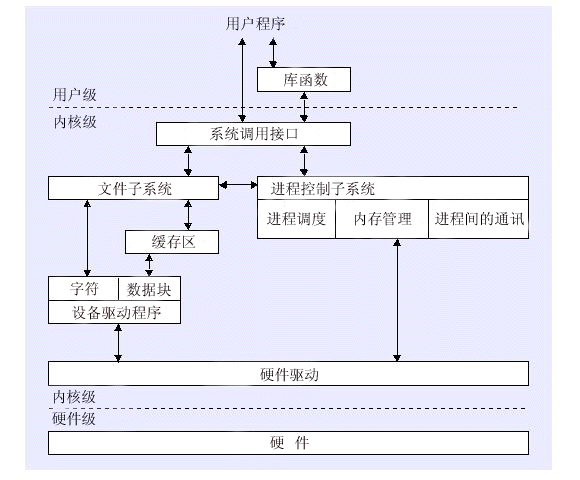

# 秋招知识点整理
[TOC]
## 前言

### 来源：

从牛客网的面经和github的总结上找<u>*盲点和考点*</u>进行总结。

### 目的：

将知识点列举出来，做到心里有数，就算遗忘具体内容，也可以不丢失大的框架。细节可以做笔记记录下来。所以这里安利ipad pro配notability。真·生产力工具。

所以在使用的时候，虽然有的章节可能是以问题的形式出现的，但是组织上仍然是以知识点为基础，将理解知识点的流程融入到问题中的，于是可以在脑海中构建相应的思维导图/逻辑框架来理解和记忆。相应的，在记录的时候，会按照如何去理解的思路和顺序，标注问题和描述。

### 分层：

下面将知识点分为3层。

**第一层基本素养**，包含数据结构+算法，操作系统，网络，分布式的知识。个人觉得这是一个程序员的基本素养。只有在了解了这些基础上，才能更扎实的学习构建于之上的上层的知识。

**第二层是优势**，在有了基本素养的基础上，对语言的实现，以及数据库或者开源项目的原理深入了解，是表现能力的关键。

第三层是细节，在于平时一些不会太care的点能否有一颗刨根问底的心，但是这个每个人时间有限，不是必须的。

## 整理

### 第一梯队（基本素养）

#### 数据结构，算法

- leetcode 
- 剑指offer
- [奇奇怪怪的问题](notes/algorithm/奇奇怪怪的问题.md)
- [面试经典](notes/algorithm/面试经典.md)
- [经典数据结构](notes/algorithm/经典数据结构.md)

#### 操作系统

- [Linux内存](notes/os/Linux内存.md)
- [Linux进程](notes/os/Linux进程.md)
- [Linux文件系统](notes/os/Linux文件系统.md)

#### 网络

- 网络分层
- TCP，UDP
  - 实现的细节
    - 通信流程
    - 包头
  - 带来的性质
  - 应用的场景（上层协议），为什么
  - 如何在应用层通过UDP实现包有序

#### 分布式

- 一致性算法
- 共识算法
- 分布式锁

---

### 第二梯队（优势）

#### JAVA

- [常用类的实现](notes/java/常用类的实现.md)

- 实现并发

- 实现同步

- BIO，NIO，AIO

- 基础数据类型和运算

- 闭包

- 常量池

- JVM的内存模型，各自的功能

  （按线程/堆/native/method area来记忆）（可以对比linux内存模型）

- JVM GC

- JVM ClassLoader

- JVM 并发

  - JUC：ConcurrentHashMap的原理

#### 数据库

- ACID-I：事务的隔离性区别和实现
- 索引
  - 优点和缺点
    - 优点：提升查询效率
    - 缺点：空间占用 + 对数据的增删改效率降低
  - 什么时候不用索引：
    - 非查询字段
    - 修改性能要求高
    - 不方便建立索引：text, image
    - 建立索引没啥用：只有很少数据值的列
  - 索引的实现原理
    - B和B+树区别
      - 叶节点存数据
      - 每个叶节点带有指向下一个节点的指针
    - B+树的优势
      - 范围查找无需中序遍历，只需找到起始块，然后链表查找即可
      - 查找次数稳定
  - 组合索引的实现原理
    - 和普通索引一样，只是依次排序左侧数据来决定偏序大小
    - mysql最左匹配
  - 聚集索引：直接决定物理存储的位置

#### 开源项目

- spring框架系列
- 中间件（Redis、Kafka等）
- Hadoop生态圈

---

### 第三梯队（细节）

#### 设计模式

- 常用设计模式

#### 工具

- Git原理
- Docker原理 

#### 权限

- Oauth
- Kerberos

---

