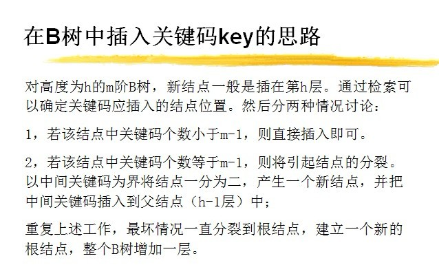

# 树

<u>***其中B树和BST以及平衡二叉树都是属于动态查找树，将数据按大小分块**</u>

## 动态查找树

### 二叉查找树

BST

### AVL树

高度平衡二叉查找树树，递归定义，高度差小于等于1

### 红黑树

定义：根黑，红后必黑，黑量相同

非高度平衡树，删除效率相对AVL树提升

### B-树

1. 性质：

   

2. 如何构建

   

   - 为什么要把中间关键码插入父节点

     因为向上分裂在保证了关键字个数的情况下，也保证了叶节点都在同一层

   - 如何保证平衡（如何满足条件4，叶节点都在同一层）

     答案同上

   - n个节点的m阶B树高度为多少

     

### B+树

1. 定义区别B-Tree
   1. 叶节点存数据
   2. 每个叶节点带有指向下一个节点的指针
2. 性质：
   1. 查询效率更稳定
   2. 单位块存储的key多，查询深度更低，从而对磁盘查询效率高
   3. 范围查找无需中序遍历，只需找到起始块，然后链表查找即可

## 堆

### 堆定义：

n个元素序列{k1, k2... ki...kn},当且仅当满足下列关系时称之为堆：
(ki <= k2i, ki <= k2i+1)或者(ki >= k2i, ki >= k2i+1), (i = 1, 2, 3, 4... n/2)

|         |                              |                                                        |
| :-----: | :--------------------------: | :----------------------------------------------------: |
|  操作   |             描述             | [时间复杂度](https://zh.wikipedia.org/wiki/时间复杂度) |
|  build  |         创建一个空堆         |                         $O(n)$                         |
| insert  |     向堆中插入一个新元素     |                      $O(\log n)$                       |
| update  | 将新元素提升使其匹配堆的性质 |                                                        |
|   get   |     获取当前堆顶元素的值     |                         $O(1)$                         |
| delete  |         删除堆顶元素         |                      $O(\log n)$                       |
| heapify | 使删除堆顶元素的堆再次成为堆 |                                                        |

### 堆排序：

流程：

1. 构建堆（自下而上）（T：$O(n)$）
2. 替换堆顶，调整堆（自上而下）（T：$O(n\log n)$）

### Dijkstra's algorithm：

每一轮寻找一个<u>距离最短</u>的点

## Trie