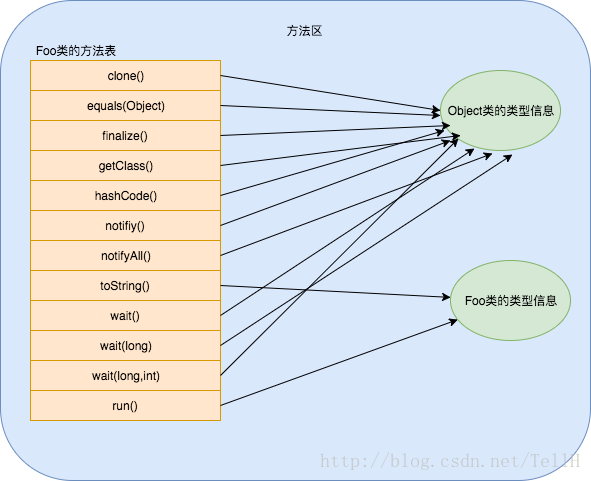
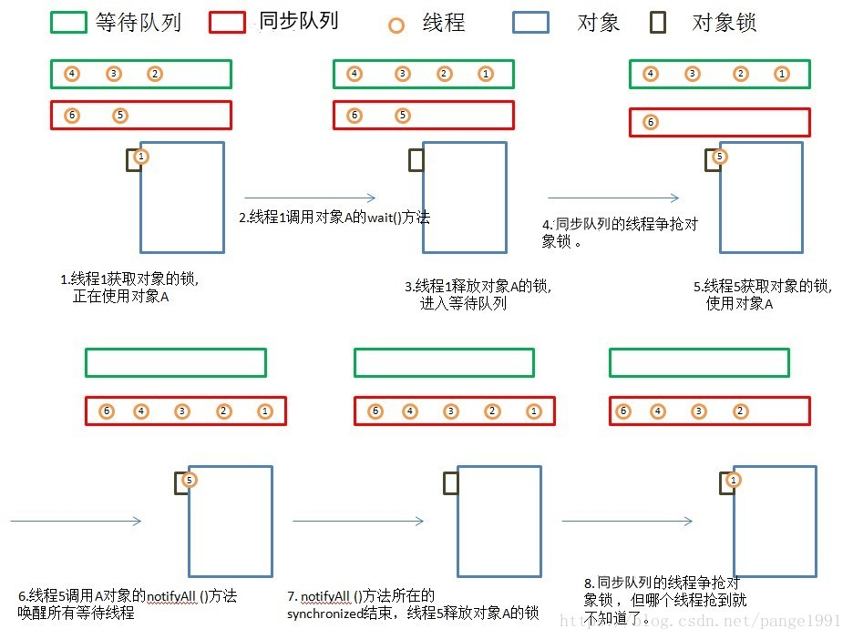

# **JAVA**-Overview

## [常用类的实现](../../notes/java/常用类的实现.md)

## BIO，NIO，AIO

## 基础数据类型和运算

- float, double - 二进制浮点数（底数是2）
  - 范围：指数决定
  - 精度：尾数决定
- decimal - 十进制浮点数（底数是10）
  - 128位，96位尾数（7.922816251E28），5位指数，1位符号位

## Switch Case

- 实现原理
  - 对于密集型，直接对应跳转地址表
  - 对于非密集型，进行离散化（值表），在对应跳转地址表
- String实现原理
  - 对string的hashcode进行switch case
- 变量作用域：提升到switch外面

## Enum枚举类型

- 使用方法（带成员变量）
- 单例模式
- EnumMap（数组即可，ordinal数组下标）
- EnumSet（位运算判断是否存在, ordinal第几位）

## 深拷贝，浅拷贝

- 浅拷贝：Clone 

  - 需要实现Cloneable接口

  - new vs clone

    轻量级（构造函数复杂）的对象可以使用new

    重量级对象可以使用clone

  - Object.clone原理：以堆上的内存存储解释的话（不计内务内存），对一个对象a的clone就是在堆上分配一个和a在堆上所占存储空间一样大的一块地方，然后把a的堆上内存的内容复制到这个新分配的内存空间上。 

- 深拷贝：反序列化

## 闭包

## 常量池

## JVM的内存区域，各自的功能（可以对比linux内存模型）

## JVM GC

- Reference

  - 强引用
  - 软引用（SoftReference）
  - 弱引用（WeakReference）
    - ThreadLocal - ThreadLocalMap - Entry继承WeakReference，使key(即ThreadLocal对象为弱引用对象)
  - 虚引用

## JVM ClassLoader

## JVM 方法调用

#### 方法调用的字节码指令

JVM里面提供了4条方法调用字节码指令。分别如下：

- invokestatic:调用静态方法
- invokespecial:调用实例构造器<init>方法、私有方法和父类方法（super(),super.method()）
- invokevirtual:调用所有的虚方法(静态方法、私有方法、实例构造器、父类方法、final方法都是非虚方法)
- invokeinterface:调用接口方法，会在运行时期再确定一个实现此接口的对象

invokestatic和invokespecial指令调用的方法都可以在解析阶段中确定唯一的调用版本，符合这个条件的有静态方法、私有方法、实例构造器、父类方法4类，它们在类加载阶段就会把符号引用解析为该方法的直接引用。直接引用就是一个指针或偏移量，可以让JVM快速定位到具体要调用的方法。

**invokevirtual**和**invokeinterface**指令调用的方法是在运行时确定具体的方法地址，接口方法和实例对象公有方法可以用这两个指令来调用。

#### 字节码指令如何执行

当JVM遇到invokevirtual或invokeinterface时，需要运行时根据方法的符号引用查找到方法地址。具体过程如下：

1. 在方法调用指令之前，需要将对象的引用压入操作数栈
2. 在执行方法调用时，找到操作数栈顶的第一个元素所指向的对象实际类型，记作C
3. 在类型C中找到与常量池中的描述符和方法名称都相符的方法，并校验访问权限。如果找到该方法并通过校验，则返回这个方法的引用；
4. 否则，按照继承关系往上查找方法并校验访问权限；
5. 如果始终没找到方法，则抛出java.lang.AbstractMethodError异常；

可以看到，JVM是<u>通过继承关系从子类往上查找的对应的方法</u>的，<u>为了提高动态分派时方法查找的效率，JVM为每个类都维护一个虚函数表。</u>

#### 虚函数表

JVM实现动态绑定的原理类似于C++的虚函数表机制，但C++的虚函数表是实现多态中必不可少的数据结构，但JVM里引入虚函数表的目的是<u>加快虚方法的索引</u>。

JVM 会在链接类的过程中，给类分配相应的方法表内存空间。每个类对应一个方法表。这些都是<u>存在于方法区</u>中的。这里与 C++略有不同，C++中每个对象的第一个指针就是指向了相应的虚函数表。而 Java 中每个对象的对象头有一个类型指针，可以索引到对应的类，在对应的类数据中对应一个方法表。也就是C++的方法表是对象级别的，而<u>Java的方法表是类级别</u>的。

一个类的方法表包含类的所有方法入口地址，从父类继承的方法放在前面，接下来是接口方法和自定义的方法。如果某个方法在子类中没有被重写，那子类的虚方法表里面的地址入口和父类相同的方法的入口地址一致。如果子类重写了这个方法，子类方法表中的地址将会替换为指向子类实现版本的入口地址。

例子：

```java
class Foo {
        @Override
        public String toString() {
            return "Foo";
        }
        void run(){}
    }
```




## JVM线程相关API

- Runnable, Callable

- Executor：执行任务（可以当前线程执行，可以new Thread执行）

  - ThreadPoolExecutor（线程池）

    - Executors.newFixedThreadPool

      - LinkedBlockingQueue：线程安全，可以限制容量

        用到了ReentrantLock进行加锁，Condition进行等待唤醒

        ```java
        /** Lock held by take, poll, etc */
        private final ReentrantLock takeLock = new ReentrantLock();
        
        /** Wait queue for waiting takes */
        private final Condition notEmpty = takeLock.newCondition();
        
        /** Lock held by put, offer, etc */
        private final ReentrantLock putLock = new ReentrantLock();
        
        /** Wait queue for waiting puts */
        private final Condition notFull = putLock.newCondition();
        ```

    - Executors.newCachedThreadPool

      - SynchronousQueue

- ExecutorCompletionService：Future, RunnableFuture, QueueingFuture

## JVM 并发

- JUC：ConcurrentHashMap的原理

- 内存模型-JMM
  - 特征：原子性，可见性，有序性
  - 基本操作
  - 操作规则/先行先发生原则
  - 实现：内存屏障，monitorenter/monitorexit，...
  
- 多线程
  - 实现（KLT，详情见操作系统Linux进程部分）
  - 状态
  
- 线程安全
  - 定义：多线程访问一个对象，无需额外同步协调，调用都可以获得正确的结果，则这个对象是线程安全的
  - 解决方案：互斥同步（synchronized, ReentrantLock），非阻塞同步（CAS），无同步（ThreadLocal）
  
- 锁优化

- synchronized原理

  - monitor对象
  - 对象头
  - 字节码：monitorenter/monitorexit/ACCESS_FLAG

- 为什么wait, notify要放在synchronized中？

  首先，wait和nofity需要与条件的判断/修改的执行绑定，即通过synchronized同步

  第二，需要sync, wait和notify一样的对象，从而在挂起时释放sync的锁

  本质上同步的对象有两个队列

  - 同步队列：竞争执行的队列（synchronized）(AQS)
  - 等待队列：等待进入竞争执行的队列（wait / notify / notifyAll）(Condition)

  