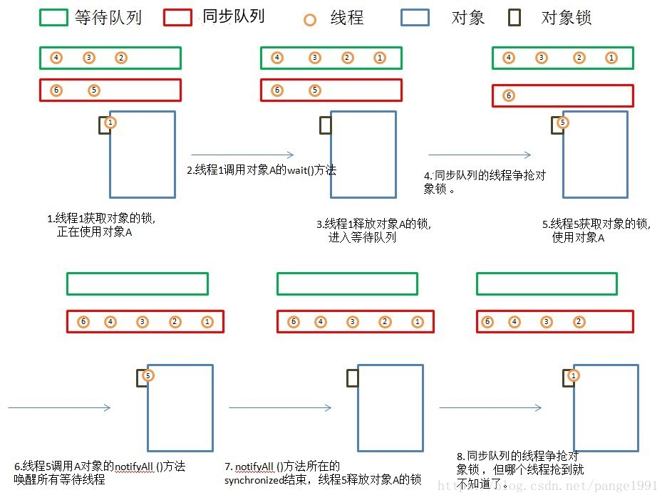

# JAVA-Overview

- [常用类的实现](../../notes/java/常用类的实现.md)

- BIO，NIO，AIO

- 基础数据类型和运算

  - float, double - 二进制浮点数（底数是2）
    - 范围：指数决定
    - 精度：尾数决定
  - decimal - 十进制浮点数（底数是10）
    - 128位，96位尾数（7.922816251E28），5位指数，1位符号位

- Switch Case

  - 实现原理
    - 对于密集型，直接对应跳转地址表
    - 对于非密集型，进行离散化（值表），在对应跳转地址表
  - String实现原理
    - 对string的hashcode进行switch case
  - 变量作用域：提升到switch外面

- Enum枚举类型

  - 使用方法（带成员变量）
  - 单例模式
  - EnumMap（数组即可，ordinal数组下标）
  - EnumSet（位运算判断是否存在, ordinal第几位）

- 深拷贝，浅拷贝

  - 浅拷贝：Clone 

    - 需要实现Cloneable接口

    - new vs clone

      轻量级（构造函数复杂）的对象可以使用new

      重量级对象可以使用clone

    - Object.clone原理：以堆上的内存存储解释的话（不计内务内存），对一个对象a的clone就是在堆上分配一个和a在堆上所占存储空间一样大的一块地方，然后把a的堆上内存的内容复制到这个新分配的内存空间上。 

  - 深拷贝：反序列化

- 闭包

- 常量池

- JVM的内存区域，各自的功能（可以对比linux内存模型）

- JVM GC

- Reference

  - 强引用
  - 软引用（SoftReference）
  - 弱引用（WeakReference）
    - ThreadLocal - ThreadLocalMap - Entry继承WeakReference，使key(即ThreadLocal对象为弱引用对象)
  - 虚引用

- JVM ClassLoader

- JVM线程相关API

  - Runnable, Callable

  - Executor：执行任务（可以当前线程执行，可以new Thread执行）

    - ThreadPoolExecutor（线程池）

      - Executors.newFixedThreadPool

        - LinkedBlockingQueue：线程安全，可以限制容量

          用到了ReentrantLock进行加锁，Condition进行等待唤醒

          ```java
          /** Lock held by take, poll, etc */
          private final ReentrantLock takeLock = new ReentrantLock();
          
          /** Wait queue for waiting takes */
          private final Condition notEmpty = takeLock.newCondition();
          
          /** Lock held by put, offer, etc */
          private final ReentrantLock putLock = new ReentrantLock();
          
          /** Wait queue for waiting puts */
          private final Condition notFull = putLock.newCondition();
          ```

      - Executors.newCachedThreadPool

        - SynchronousQueue

  - ExecutorCompletionService：Future, RunnableFuture, QueueingFuture

- JVM 并发

  - JUC：ConcurrentHashMap的原理
  
  - 内存模型-JMM
    - 特征：原子性，可见性，有序性
    - 基本操作
    - 操作规则/先行先发生原则
    - 实现：内存屏障，monitorenter/monitorexit，...
    
  - 多线程
    - 实现（KLT，详情见操作系统Linux进程部分）
    - 状态
    
  - 线程安全
    - 定义：多线程访问一个对象，无需额外同步协调，调用都可以获得正确的结果，则这个对象是线程安全的
    - 解决方案：互斥同步（synchronized, ReentrantLock），非阻塞同步（CAS），无同步（ThreadLocal）
    
  - 锁优化
  
  - 为什么wait, notify要放在synchronized中？
  
    首先，wait和nofity需要与条件的判断修改的执行绑定，即通过synchronized同步
  
    第二，需要sync, wait和notify一样的对象，从而在挂起时释放sync的锁
  
    本质上同步的对象有两个队列
  
    - 同步队列：竞争执行的队列（synchronized）(AQS)
    - 等待队列：等待进入竞争执行的队列（wait / notify / notifyAll）(Condition)
  
    