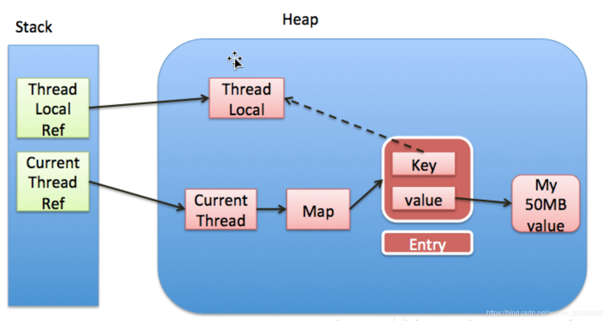

- ThreadLocal - ThreadLocalMap - Entry - WeakReference

  - [ThreadLocal内存泄漏问题](https://juejin.im/post/5ba9a6665188255c791b0520)

    

- WeakReference - Reference

- EnumSet

#### Map:

- HashMap
  - 数组，链表，红黑树
- ConcurrencyHashMap
  - 1.7 Segment
  - 1.8 Red-Black Tree CAS
- TreeMap
  - 红黑树
- LinkedHashMap
  - HashpMap + Entry.before + Entry.after
- EnumMap
  - 数组（无冲突）
- ThreadLocalMap
  - 数组，线性探测