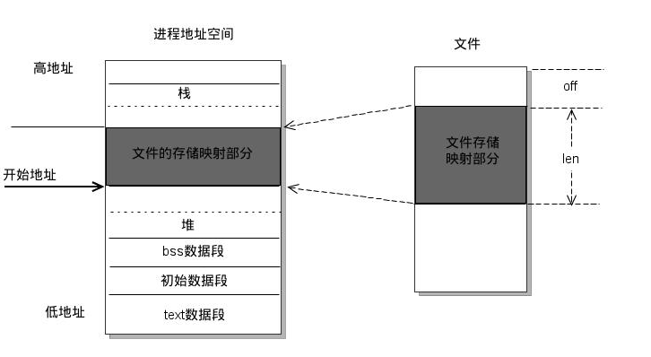

# Linux进程和线程

### 内存模型，创建和线程库

1. 在内存中的模型分别是什么样的？

   

   

2. 创建进程系统调用：fork，vfork，clone
   1. fork出来的子进程是父进程的一个拷贝，即，子进程从父进程得到了数据段和堆栈段的拷贝，这些需要分配新的内存；而对于只读的代码段，通常使用共享内存的方式访问；而vfork则是子进程与父进程共享内存空间, 子进程对虚拟地址空间任何数据的修改同样为父进程所见；clone则由用户通过参clone_flags 的设置来决定哪些资源共享，哪些资源拷贝。 
   2. fork不对父子进程的执行次序进行任何限制，fork返回后，子进程和父进程都从调用fork函数的下一条语句开始行，但父子进程运行顺序是不定的，它取决于内核的调度算法；而在vfork调用中，子进程先运行，父进程挂起，直到子进程调用了exec或exit之后，父子进程的执行次序才不再有限制；clone中由标志CLONE_VFORK来决定子进程在执行时父进程是阻塞还是运行，若没有设置该标志，则父子进程同时运行，设置了该标志，则父进程挂起，直到子进程结束为止。

3. 内核线程，轻量级进程，用户线程：

   - 内核线程（KLT）
     内核线程只运行在内核态，不受用户态上下文的拖累。

     - 处理器竞争：可以在全系统范围内竞争处理器资源；
     - 使用资源：唯一使用的资源是内核栈和上下文切换时保持寄存器的空间
     - 调度：调度的开销可能和进程自身差不多昂贵
     - 同步效率：资源的同步和数据共享比整个进程的数据同步和共享要低一些。

   - 轻量级进程
     轻量级进程(LWP)是建立在内核之上并由内核支持的用户线程，它是内核线程的高度抽象，每一个轻量级进程都与一个特定的内核线程关联。内核线程只能由内核管理并像普通进程一样被调度。

     轻量级进程由<u>clone()系统调用创建</u>，参数是CLONE_VM，<u>即与父进程是共享进程地址空间和系统资源。</u>

     局限性。首先，大多数LWP的操作，如建立、析构以及同步，都需要进行<u>系统调用</u>。系统调用的代价相对较高：需要在user mode和kernel mode中切换。其次，每个LWP都需要有一个<u>内核线程支持</u>，因此LWP要消耗内核资源（内核线程的栈空间）。因此一个系统不能支持大量的LWP。

     与普通进程区别：LWP只有一个最小的执行上下文和调度程序所需的统计信息。
     
     - 处理器竞争：因与特定内核线程关联，因此可以在全系统范围内竞争处理器资源
   - 使用资源：与父进程共享进程地址空间
     
     - 调度：像普通进程一样调度
     
   - 用户线程
     用户线程是完全建立在用户空间的线程库，用户线程的创建、调度、同步和销毁全又库函数在用户空间完成，不需要内核的帮助。因此这种线程是极其低消耗和高效的。

     局限性：当一个线程系统调用阻塞的时候，整个进程阻塞。且由于核心信号无法定位到线程，不用用于多核处理器。

     - 处理器竞争：单纯的用户线程是建立在用户空间，其对内核是透明的，因此其所属进程单独参与处理器的竞争，而进程的所有线程参与竞争该进程的资源。
   - 使用资源：与所属进程共享进程地址空间和系统资源。
     
     - 调度：由在用户空间实现的线程库，在所属进程内进行调度

4. Linux线程库

   LinuxThreads是用户空间的线程库，<u>所采用的是线程-进程1对1模型</u>(即一个用户线程对应一个轻量级进程，而一个轻量级进程对应一个特定的内核线程)，将线程的调度等同于进程的调度，调度交由内核完成，而线程的创建、同步、销毁由核外线程库完成（LinuxThreads已绑定到 GLIBC中发行）。

   在LinuxThreads中，由专门的一个管理线程处理所有的线程管理工作。当进程第一次调用pthread_create()创建线程时就会先 创建(clone())并启动管理线程。后续进程pthread_create()创建线程时，都是管理线程作为pthread_create()的调用 者的子线程，通过调用clone()来创建用户线程，并记录轻量级进程号和线程id的映射关系，因此，用户线程其实是管理线程的子线程。

   LinuxThreads只支持调度范围为PTHREAD_SCOPE_SYSTEM的调度，默认的调度策略是SCHED_OTHER。

   <u>用户线程调度策略</u>也可修改成SCHED_FIFO或SCHED_RR方式，这两种方式支持优先级为0-99,而SCHED_OTHER只支持0。

   - SCHED_OTHER 分时调度策略，
   - SCHED_FIFO   实时调度策略，先到先服务
   - SCHED_RR     实时调度策略，时间片轮转

   SCHED_OTHER是普通进程的，后两个是实时进程的（一般的进程都是普通进程，系统中出现实时进程的机会很少）。SCHED_FIFO、 SCHED_RR优先级高于所有SCHED_OTHER的进程，所以只要他们能够运行，在他们运行完之前，所有SCHED_OTHER的进程的都没有得到 执行的机会。

### 进程间通信（IPC）

1. mmap（共享内存）：能够很容易控制容量，速度快，但要保持同步，比如一个进程在写的时候，另一个进程要注意读写的问题，相当于线程中的线程安全，当然，共享内存区同样可以用作线程间通讯，不过没这个必要，线程间本来就已经共享了同一进程内的一块内存

2. 信号量：不能传递复杂消息，只能用来同步

3. 管道：速度慢，容量有限，只有父子进程能通讯

4. 消息队列：容量受到系统限制，且要注意第一次读的时候，要考虑上一次没有读完数据的问题

5. socket：可用于不同机器间的进程通信

   

### Linux特殊进程：

- idle进程(PID=0)：由系统自动创建, 运行在内核态。完成加载系统后，演变为<u>进程</u>调度、交换
- init进程(PID=1)：由idle通过kernel_thread创建，完成系统的初始化. 是系统中所有其它<u>用户进程</u>的祖先进程。Linux中的所有进程都是有init进程创建并运行的。首先Linux内核启动，然后在用户空间中启动init进程，再启动其他系统进程。在系统启动完成完成后，init将变为守护进程监视系统其他进程。
- kthreadd(PID=2)：由idle通过kernel_thread创建，并始终运行在内核空间, 负责所有<u>内核线程</u>的调度和管理 

